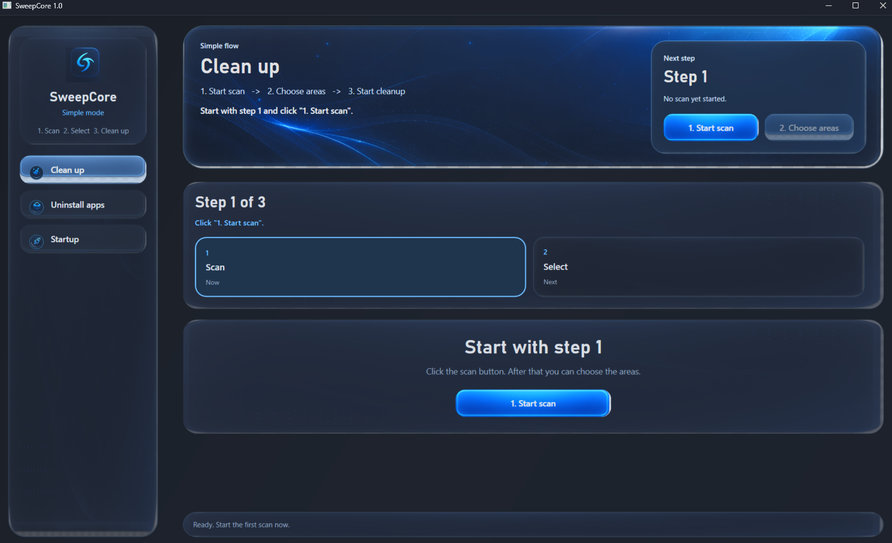
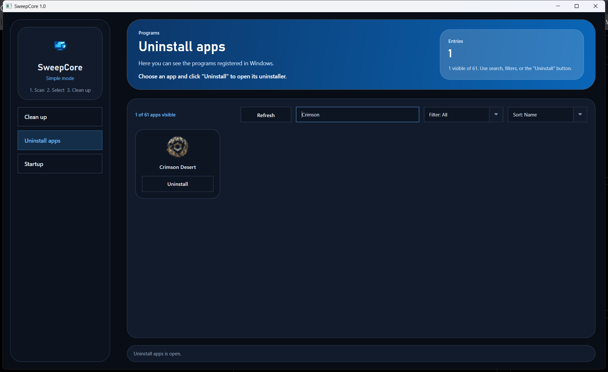
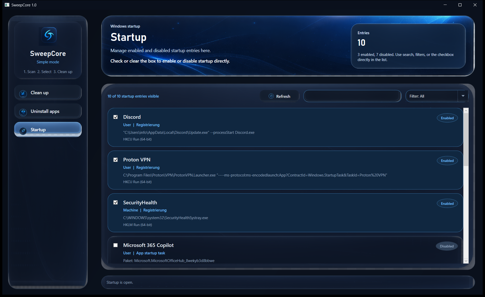

# SweepCore 1.1

SweepCore is a Windows desktop utility for three common maintenance tasks:

- cleaning temporary files and selected browser data
- uninstalling installed applications
- managing Windows startup entries

The project is built around one idea: make routine cleanup actions easier to understand, easier to review, and safer to use.

## Overview

SweepCore brings cleanup, uninstall, and startup controls into one focused desktop interface.

Instead of exposing a long list of technical options, the app uses a guided flow for cleanup, a simple app view for uninstalling software, and a direct startup list for enabling or disabling launch entries.

## Screenshots

### Clean up



### Uninstall apps



### Startup



## Installation

If you just want to use SweepCore, run the included single-file installer:

`dist/SweepCoreSetup.exe`

The installer places SweepCore in the local user profile, creates a desktop shortcut, adds Start menu entries, and includes a normal Windows uninstaller.

## Core Features

### Clean up

- guided scan -> select -> clean workflow
- optional full temp cleanup mode for users who want a more aggressive cleanup
- selectable browser data options for cache, cookies, and history
- clear separation of cleanup targets
- file preview for the current selection
- explicit selection before cleanup starts
- cleanup uses the Windows Recycle Bin

### Uninstall apps

- searchable list of installed applications
- filters and sorting for easier browsing
- direct access to each program's registered Windows uninstaller
- automatic refresh after uninstall actions when possible

### Startup

- view enabled and disabled startup entries in one place
- enable or disable startup items directly
- support for classic registry startup entries and Windows app startup tasks
- search and filtering for faster management

## Cleanup Scope

SweepCore currently scans supported locations such as:

- user temp files older than one week by default, or all matching temp files when full temp cleanup is enabled
- Windows temp files older than one week by default, or all matching temp files when full temp cleanup is enabled
- crash dump files
- Windows Error Reporting files
- browser cache data for Chrome, Edge, Brave, and Firefox
- browser cookies for Chrome, Edge, Brave, and Firefox
- browser history for Chrome, Edge, and Brave

Cookies are optional and include an explicit logout warning. Passwords, saved addresses, autofill data, bookmarks, personal files, and unrelated profile databases are excluded. Firefox history is not removed because Firefox stores browsing history together with bookmarks.

## Safety Approach

- cleanup requires an explicit selection
- cleanup is sent to the Recycle Bin instead of being permanently deleted
- only supported cleanable locations are included
- protected and blocked files are not treated like normal cleanup targets
- uninstall actions open the normal registered Windows uninstaller
- startup changes are made through Windows startup mechanisms
- cleanup runs create an action log

## Interface Goals

- keep the next important action visible
- reduce visual clutter for non-technical users
- make cleanup choices understandable before anything is removed
- keep app uninstall and startup controls simple and direct
- default to a dark interface with a focused navigation layout

## Project Structure

- `SweepCoreApp/` contains the WPF application source
- `Assets/` contains repository assets such as the app logo
- `docs/screenshots/` contains the current UI screenshots used in this README
- `build.ps1` builds the application locally
- `build-installer.ps1` builds the single-file installer locally
- `dist/SweepCoreSetup.exe` is the generated installer that can be shared directly
- `bin/` is ignored by Git because it contains generated build output only

## Build

SweepCore is currently built locally on Windows through the included PowerShell build scripts.

```powershell
powershell -ExecutionPolicy Bypass -File .\build.ps1
```

After a successful build, the generated executable is available locally at:

`bin/SweepCore.exe`

To build the shareable installer:

```powershell
powershell -ExecutionPolicy Bypass -File .\build-installer.ps1
```

After a successful installer build, the generated setup is available locally at:

`dist/SweepCoreSetup.exe`
